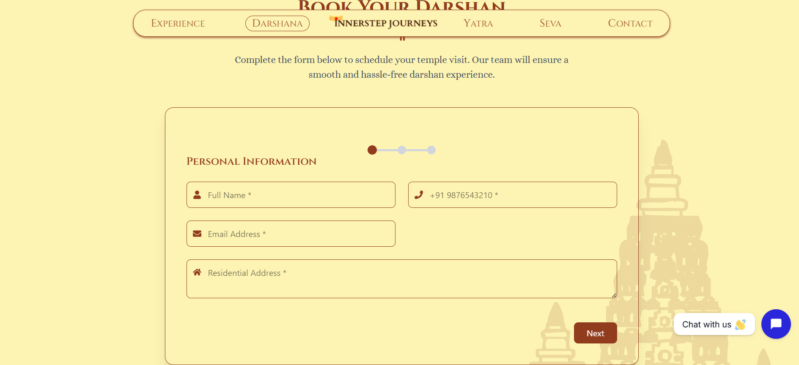
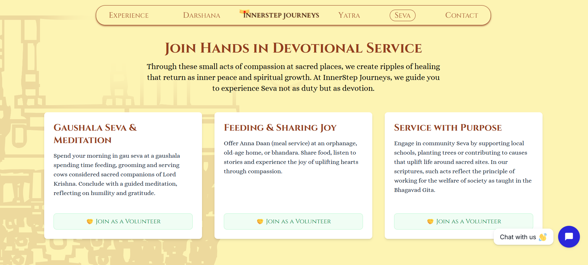
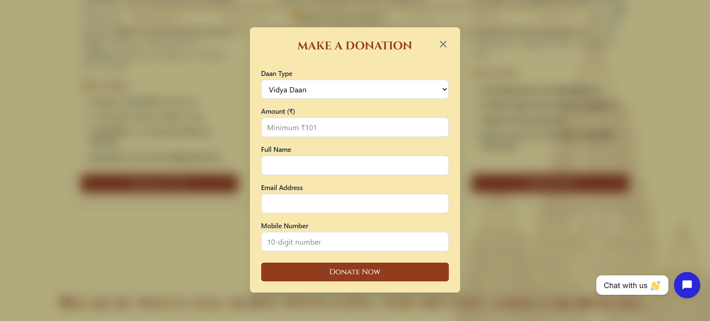

# Yatra – Spiritual Travel & Temple Services Platform

Yatra is a spiritual travel and temple services platform that allows devotees to plan pilgrimages, book darshan slots, explore temple experiences, and contribute through seva (donations). The platform simplifies spiritual journeys by organizing multiple temple-related services in a single system.

🔗 Live Demo: https://your-yatra-project-link.vercel.app

---

# Overview

The Yatra platform helps users manage spiritual activities through four primary modules:

* Experience booking
* Darshan slot reservation
* Yatra pilgrimage planning
* Seva (donation) contributions

Users can explore destinations, book temple-related services, and manage their bookings through a centralized interface.

---

# Platform Modules

## 1️⃣ Experience Module

Allows users to explore and book spiritual or cultural experiences provided by temples.

### Features

* Browse available experiences
* View detailed information about experiences
* Book experiences online

### Screenshot


---

## 2️⃣ Darshan Module

Enables devotees to book darshan slots in advance, reducing waiting time at temples.

### Features

* View available darshan slots
* Reserve darshan tickets
* Manage booked darshan visits

### Screenshot



---

## 3️⃣ Yatra Module

Helps users plan and book pilgrimage journeys to spiritual destinations.

### Features

* Browse pilgrimage destinations
* View yatra itinerary
* Book travel packages

### Screenshot


---

## 4️⃣ Seva Module

Allows devotees to make donations and participate in temple services.

### Features

* Online donation (daan)
* Support temple services
* Participate in religious offerings

### Screenshot




---

# Project Structure

```id="yatra-structure"
app
 ├ service
 │   ├ activitiesSection.tsx
 │   ├ imageGallery.tsx
 │   ├ serviceBanner.tsx
 │   └ page.tsx
 │
 ├ components
 │   ├ featuredDestination
 │   ├ homepageBanner
 │   ├ testimonial
 │   ├ welcome
 │   ├ whatWeOffer
 │   ├ AboutUs.tsx
 │   ├ BookingModal.tsx
 │   ├ DonationModal.tsx
 │   ├ YatraBookingModal.tsx
 │   ├ contactUsForm.tsx
 │   └ heroSection.tsx
 │
 ├ darshan
 ├ yatra
 │
 ├ lib
 │   ├ data
 │   ├ dateAndTime.ts
 │   └ supabase.ts
 │
 ├ layout.tsx
 ├ page.tsx
 └ globals.css

public
 ├ images
 └ svg
```

---

# Tech Stack

Frontend:

* Next.js
* React
* TypeScript
* Tailwind CSS

Backend / Services:

* Supabase
* PostgreSQL

---

# Installation

Clone the repository

```id="clone"
git clone https://github.com/akshitasyal/yatra-project.git
```

Go to project folder

```id="cd"
cd yatra-project
```

Install dependencies

```id="install"
npm install
```

Run the development server

```id="dev"
npm run dev
```

---

# Future Improvements

* Online payment gateway integration
* User authentication system
* Booking notifications
* Reviews and ratings for experiences
* Mobile responsive enhancements

---

# Contributing

Contributions are welcome.

1. Fork the repository
2. Create a new branch
3. Make your changes
4. Submit a pull request

---

# Author

Akshita Syal
GitHub: https://github.com/akshitasyal

⭐ If you like this project, consider giving it a star.
