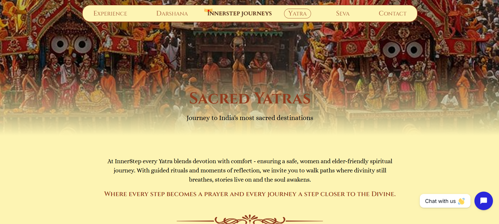

# InnerStep Journeys 

A modern travel and spiritual journey booking platform designed to help users explore and plan meaningful trips to sacred destinations across India.

##  Overview

InnerStep Journeys is a web-based platform where users can explore different spiritual destinations, view travel information, and book personalized journeys.
The platform provides a clean user interface and organized destination pages for various Yatra locations.

##  Features

* 🧭 Explore popular spiritual destinations
* 📍 Dedicated pages for each Yatra location
* 🖼 Image gallery for destinations
* 📝 Testimonials section
* 📩 Contact form for travel inquiries
* 🗺 Featured destinations section
* 📅 Booking modal for trip requests
* 📱 Responsive design for all devices

## 🗺 Destinations Included

* Varanasi
* Vrindavan
* Rishikesh
* Ujjain

Each destination includes detailed information and visuals to help travelers plan their spiritual journey.

## 🛠 Tech Stack

Frontend:

* Next.js
* React
* TypeScript
* Tailwind CSS

Other Tools:

* Git & GitHub
* Component-based architecture

## 📂 Project Structure

```
app
 ├── components
 │   ├── testimonial
 │   ├── featuredDestination
 │   ├── contactUsForm
 │   └── YatraBookingModal
 │
 ├── yatra
 │   ├── varanasi
 │   ├── vrindavan
 │   ├── rishikesh
 │   └── ujjain
 │
 ├── layout.tsx
 ├── page.tsx
 └── lib
```

## ⚙️ Installation & Setup

Clone the repository:

```
git clone https://github.com/akshitasyal/InnerStep-Journeys.git
```

Navigate to the project folder:

```
cd InnerStep-Journeys
```

Install dependencies:

```
npm install
```

Run the development server:

```
npm run dev
```

Open in browser:

```
http://localhost:3000
```



## 🌱 Future Improvements

* User authentication
* Online booking and payment system
* Admin dashboard for managing destinations
* Travel itinerary generation
* Integration with maps and travel APIs

## 👩‍💻 Author

**Akshita Syal**

GitHub:
https://github.com/akshitasyal

---

⭐ If you like this project, consider giving it a star!
